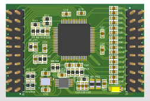
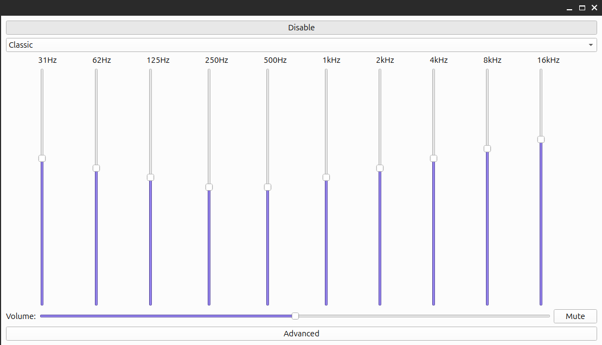

# sta309a Audio Card

This is an 8-channel audio card featuring TDM/I2S interfaces and versatile audio processing capabilities.

## Features

- Supports TDM/I2S input and output for high-quality audio streaming.
- Compatible with all standard audio sample rate multipliers.
- Provides 8 independent PWM outputs for driving speakers.
- Includes various audio effects that can be applied separately on each channel.
- Enables per-channel customization of audio parameters and effects for flexible sound management.

---

This audio card is ideal for multi-channel audio applications where precise control and high fidelity are required.

---

## Compatibility and Usage

This audio card can be connected to Raspberry Pi and Orange Pi boards via I2S interface.  
However, to enable TDM functionality, additional boards such as the T507 are required.
